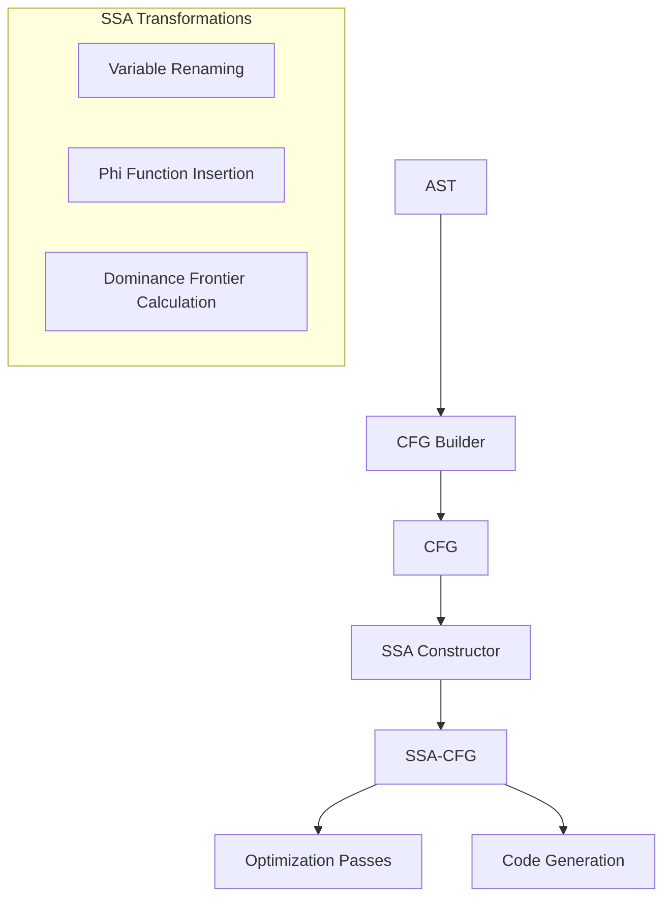

# Control Flow Graph with SSA Form Design

## Overview

This document outlines the design for adding Control Flow Graph (CFG) support with Static Single Assignment (SSA) form to the C parser. SSA form is an intermediate representation where each variable is assigned exactly once, making many optimizations simpler and more efficient.

## Architecture Overview



## 1. Enhanced CFG Data Structures

### Basic Block Structure with SSA Support

```c
typedef struct BasicBlock {
    int id;                          // Unique identifier
    InstructionList* instructions;   // SSA instructions (not AST nodes)
    struct BasicBlock** successors;  // Outgoing edges
    int successor_count;
    struct BasicBlock** predecessors;// Incoming edges  
    int predecessor_count;
    char* label;                     // Optional label for debugging
    
    // SSA-specific fields
    PhiNodeList* phi_nodes;          // Phi functions at block entry
    struct BasicBlock* idom;         // Immediate dominator
    struct BasicBlock** dom_frontier;// Dominance frontier
    int dom_frontier_count;
} BasicBlock;
```

### SSA Instruction Types

```c
typedef enum {
    SSA_PHI,           // Phi function
    SSA_ASSIGN,        // Simple assignment
    SSA_BINARY_OP,     // Binary operation
    SSA_UNARY_OP,      // Unary operation
    SSA_LOAD,          // Load from memory
    SSA_STORE,         // Store to memory
    SSA_CALL,          // Function call
    SSA_RETURN,        // Return statement
    SSA_BRANCH,        // Conditional branch
    SSA_JUMP           // Unconditional jump
} SSAInstructionType;
```

### SSA Value Structure

```c
typedef struct SSAValue {
    enum {
        SSA_VAR,       // SSA variable (e.g., x_1, x_2)
        SSA_CONST,     // Constant value
        SSA_TEMP       // Temporary value
    } type;
    union {
        struct {
            char* base_name;    // Original variable name
            int version;        // SSA version number
        } var;
        int const_value;
        int temp_id;
    } data;
} SSAValue;
```

### SSA Instructions

```c
typedef struct SSAInstruction {
    SSAInstructionType type;
    SSAValue* dest;              // Destination (if any)
    SSAValue** operands;         // Source operands
    int operand_count;
    
    // Type-specific data
    union {
        struct {
            TokenType op;        // For binary/unary ops
        } op_data;
        struct {
            char* func_name;     // For calls
        } call_data;
        struct {
            BasicBlock* true_target;
            BasicBlock* false_target;
            SSAValue* condition;
        } branch_data;
    } data;
} SSAInstruction;
```

### Phi Node Structure

```c
typedef struct PhiNode {
    SSAValue* dest;                      // Variable being defined
    struct {
        BasicBlock* block;               // Predecessor block
        SSAValue* value;                 // Value from that predecessor
    }* operands;
    int operand_count;
} PhiNode;
```

## 2. SSA Construction Algorithm

### Phase 1: Build Initial CFG

```c
CFG* build_cfg_from_ast(Node* ast);
```

### Phase 2: Compute Dominance Information

```c
typedef struct DominanceInfo {
    BasicBlock** idom;           // Immediate dominators
    BasicBlock*** dom_tree;      // Dominance tree children
    int* dom_tree_sizes;
    BasicBlock*** dom_frontier;  // Dominance frontiers
    int* dom_frontier_sizes;
} DominanceInfo;

DominanceInfo* compute_dominance(CFG* cfg);
```

### Phase 3: Insert Phi Functions

```c
// Compute where phi functions are needed
typedef struct {
    char* var_name;
    BasicBlock** def_blocks;     // Blocks that define this variable
    int def_count;
    BasicBlock** phi_blocks;     // Blocks that need phi functions
    int phi_count;
} VariablePhiInfo;

void insert_phi_functions(CFG* cfg, DominanceInfo* dom_info);
```

### Phase 4: Rename Variables

```c
typedef struct RenameState {
    // Stack of versions for each variable
    struct {
        char* var_name;
        int* version_stack;
        int stack_size;
        int stack_capacity;
        int next_version;
    }* var_stacks;
    int var_count;
} RenameState;

void rename_variables(CFG* cfg, DominanceInfo* dom_info);
```

## 3. SSA Construction Example

### Original Code:
```c
int x = 1;
if (cond) {
    x = 2;
} else {
    x = 3;
}
y = x + 1;
```

### CFG with SSA:
```
Block 0 (Entry):
  x_1 = 1
  branch cond, Block1, Block2

Block 1:
  x_2 = 2
  jump Block3

Block 2:
  x_3 = 3
  jump Block3

Block 3:
  x_4 = φ(x_2, x_3)  // Phi function
  y_1 = x_4 + 1
```

## 4. Advanced SSA Features

### 4.1 Memory SSA (for handling pointers)

```c
typedef struct MemorySSA {
    // Memory versions for load/store operations
    int next_mem_version;
    
    // Memory phi nodes
    struct MemPhiNode {
        int mem_version;
        int* pred_versions;
        int pred_count;
    }* mem_phis;
    int mem_phi_count;
} MemorySSA;
```

### 4.2 Pruned SSA (minimize unnecessary phi functions)

```c
typedef struct PrunedSSAInfo {
    // Live variable analysis results
    BitSet** live_in;
    BitSet** live_out;
    
    // Only insert phi functions for live variables
    bool should_insert_phi(char* var, BasicBlock* block);
} PrunedSSAInfo;
```

### 4.3 SSA Destruction (convert back from SSA)

```c
// For code generation
void destruct_ssa(CFG* cfg);

// Methods for phi elimination
typedef enum {
    PHI_ELIM_NAIVE,        // Simple variable copies
    PHI_ELIM_COALESCING,   // Try to eliminate copies
    PHI_ELIM_PARALLEL      // Parallel copy semantics
} PhiEliminationMethod;
```

## 5. Optimization Passes on SSA Form

### 5.1 Constant Propagation

```c
typedef struct ConstantPropagation {
    // Lattice values: TOP, CONST(n), BOTTOM
    struct LatticeValue {
        enum { LATTICE_TOP, LATTICE_CONST, LATTICE_BOTTOM } type;
        int const_value;
    }* values;
    
    void (*propagate)(CFG* cfg);
} ConstantPropagation;
```

### 5.2 Dead Code Elimination

```c
typedef struct DeadCodeElimination {
    BitSet* live_instructions;
    
    void (*mark_live)(CFG* cfg);
    void (*sweep_dead)(CFG* cfg);
} DeadCodeElimination;
```

### 5.3 Global Value Numbering

```c
typedef struct GVN {
    // Value number mapping
    struct ValueNumber {
        SSAInstruction* inst;
        int number;
    }* value_numbers;
    int next_number;
    
    void (*number_values)(CFG* cfg);
    void (*eliminate_redundant)(CFG* cfg);
} GVN;
```

## 6. Use-Def Chains in SSA

```c
typedef struct UseDefInfo {
    // For each SSA value, track its uses
    struct UseList {
        SSAValue* value;
        SSAInstruction** uses;
        int use_count;
    }* use_lists;
    int list_count;
    
    // Quick lookup
    SSAInstruction* get_def(SSAValue* value);
    SSAInstruction** get_uses(SSAValue* value, int* count);
} UseDefInfo;
```

## 7. CFG/SSA Utilities

### 7.1 Visualization

```c
// Generate DOT format with SSA annotations
void cfg_ssa_to_dot(CFG* cfg, const char* filename);

// Pretty print SSA form
void print_ssa_instruction(SSAInstruction* inst);
void print_phi_node(PhiNode* phi);
void print_ssa_cfg(CFG* cfg);
```

### 7.2 Verification

```c
// Verify SSA properties
typedef struct SSAVerifier {
    bool check_single_assignment(CFG* cfg);
    bool check_phi_operands(CFG* cfg);
    bool check_dominance(CFG* cfg);
    bool verify_ssa(CFG* cfg);
} SSAVerifier;
```

## 8. Integration Example

```c
// In main.c
int main(int argc, char** argv) {
    // ... existing parsing code ...
    
    if (generate_ssa) {
        // Build CFG
        CFG* cfg = build_cfg_from_ast(ast);
        
        // Convert to SSA form
        DominanceInfo* dom_info = compute_dominance(cfg);
        insert_phi_functions(cfg, dom_info);
        rename_variables(cfg, dom_info);
        
        // Run optimizations
        if (optimize) {
            constant_propagation(cfg);
            dead_code_elimination(cfg);
            global_value_numbering(cfg);
        }
        
        // Generate output
        if (output_dot) {
            cfg_ssa_to_dot(cfg, "output_ssa.dot");
        }
        
        // Generate code
        if (generate_code) {
            destruct_ssa(cfg);
            generate_target_code(cfg, output_file);
        }
        
        // Cleanup
        free_dominance_info(dom_info);
        free_cfg(cfg);
    }
}
```

## 9. Testing Strategy

### 9.1 Unit Tests

1. **Dominance Computation**
   - Test immediate dominators
   - Test dominance frontiers
   - Test with complex CFGs

2. **Phi Insertion**
   - Test minimal phi placement
   - Test pruned SSA
   - Test with multiple variables

3. **Variable Renaming**
   - Test version numbering
   - Test phi operand assignment
   - Test with nested scopes

### 9.2 Integration Tests

1. **End-to-end SSA construction**
2. **Optimization effectiveness**
3. **SSA destruction correctness**

### 9.3 Benchmark Tests

1. **Performance on large functions**
2. **Memory usage**
3. **Optimization time**

## 10. Implementation Phases

### Phase 1: Basic CFG Construction
- Implement CFG data structures
- Build CFG from AST
- Add visualization

### Phase 2: Dominance Analysis
- Implement dominance tree construction
- Compute dominance frontiers
- Add dominance queries

### Phase 3: SSA Construction
- Implement phi insertion algorithm
- Implement variable renaming
- Add SSA verification

### Phase 4: Basic Optimizations
- Constant propagation
- Dead code elimination
- Copy propagation

### Phase 5: Advanced Features
- Memory SSA
- Advanced optimizations (GVN, PRE)
- SSA destruction

### Phase 6: Code Generation
- Target-independent IR
- Register allocation
- Target-specific backends

## 11. Example: Loop in SSA Form

### Original Code:
```c
int sum = 0;
int i = 0;
while (i < n) {
    sum = sum + i;
    i = i + 1;
}
```

### SSA Form:
```
Block 0 (Entry):
  sum_1 = 0
  i_1 = 0
  jump Block1

Block 1 (Loop Header):
  sum_2 = φ(sum_1, sum_3)
  i_2 = φ(i_1, i_3)
  t_1 = i_2 < n_1
  branch t_1, Block2, Block3

Block 2 (Loop Body):
  sum_3 = sum_2 + i_2
  i_3 = i_2 + 1
  jump Block1

Block 3 (Exit):
  // sum_2 and i_2 are available here
```

## 12. Benefits of SSA Form

1. **Simplified Optimizations**
   - Each value has exactly one definition
   - Use-def chains are explicit
   - Many optimizations become simpler

2. **Better Analysis**
   - Easier to track value flow
   - Simplified alias analysis
   - Better constant propagation

3. **Efficient Algorithms**
   - Many optimizations are linear in SSA
   - Sparse representations possible
   - Incremental updates easier

## 13. References

- Cytron et al., "Efficiently Computing Static Single Assignment Form and the Control Dependence Graph"
- Briggs et al., "Practical Improvements to the Construction and Destruction of Static Single Assignment Form"
- Cooper & Torczon, "Engineering a Compiler"