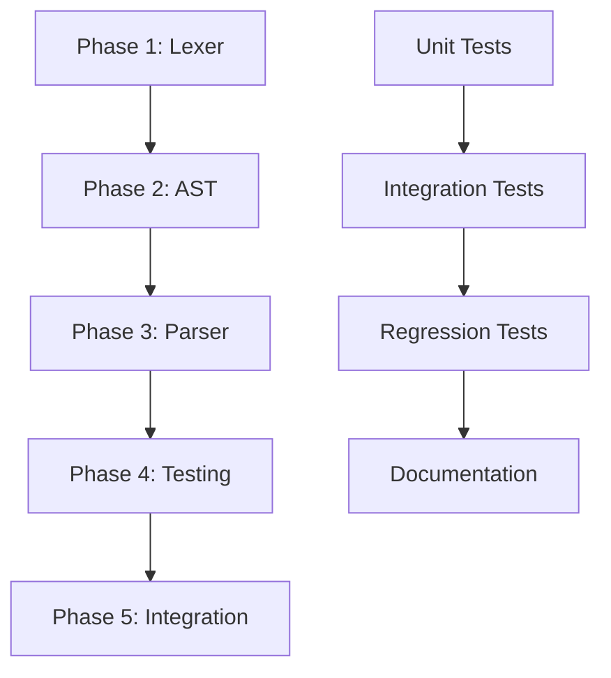

# Implementation Plan: Adding char and unsigned char Support to C Parser

## Overview

This document outlines the comprehensive plan to add support for `char` and `unsigned char` types to the existing C parser. The implementation will extend the current type system while maintaining backward compatibility with existing `int`, `bool`, and `_BitInt` types.

## Current State Analysis

### Supported Types
- [`int`](lexer.h:8) - Integer type
- [`bool`](lexer.h:8) - Boolean type  
- [`_BitInt`](lexer.h:8) - Custom bit-width integer type
- [`void`](lexer.h:8) - Void type for functions

### Architecture Overview
- **Lexer**: Keywords handled in [`identifier_or_keyword()`](lexer.c:104-136)
- **Parser**: Variable declarations parsed in [`parse_declaration_statement()`](parser.c:379-450)
- **AST**: Type information stored in [`VarDeclNode.var_type`](ast.h:66) field
- **Type Representation**: Uses [`TokenType`](ast.h:66) enumeration

## Requirements

### Target Types
1. **`char`** - 8-bit signed integer (-128 to 127), default behavior
2. **`unsigned char`** - 8-bit unsigned integer (0 to 255)

### Design Goals
- Maintain backward compatibility
- Follow C standard semantics
- Support arrays of char types
- Enable function parameters and return types
- Provide clear error messages

## Implementation Plan

### Phase 1: Lexer Extensions

#### 1.1 Token Type Additions
**File**: [`lexer.h`](lexer.h:8)
```c
// Add to TokenType enum:
TOKEN_CHAR,      // for "char" keyword
TOKEN_UNSIGNED,  // for "unsigned" keyword
```

#### 1.2 Keyword Recognition
**File**: [`lexer.c`](lexer.c:117-131)
```c
// Add to identifier_or_keyword() function:
if (strcmp(value, "char") == 0) { 
    free(value); 
    return make_token(TOKEN_CHAR, "char", 4, lexer->line, start_column); 
}
if (strcmp(value, "unsigned") == 0) { 
    free(value); 
    return make_token(TOKEN_UNSIGNED, "unsigned", 8, lexer->line, start_column); 
}
```

### Phase 2: AST Extensions

#### 2.1 Enhanced Type Representation
**File**: [`ast.h`](ast.h:64-71)

**Option A: Extend existing VarDeclNode**
```c
typedef struct {
    Node base;
    TokenType var_type;        // TOKEN_INT, TOKEN_BOOL, TOKEN_BITINT, TOKEN_CHAR
    int is_unsigned;           // 0 for signed, 1 for unsigned (new field)
    char* var_name;
    int array_size;
    int bit_width;
    Node* initializer;
} VarDeclNode;
```

**Option B: Create type descriptor struct**
```c
typedef struct {
    TokenType base_type;       // TOKEN_CHAR, TOKEN_INT, etc.
    int is_unsigned;           // 0 for signed, 1 for unsigned
    int bit_width;             // For _BitInt, 8 for char, 32 for int, etc.
} TypeDescriptor;

typedef struct {
    Node base;
    TypeDescriptor type_desc;  // Enhanced type information
    char* var_name;
    int array_size;
    Node* initializer;
} VarDeclNode;
```

#### 2.2 AST Creation Function Updates
**File**: [`ast.h`](ast.h:184)
```c
// Update function signature:
Node* create_var_decl_node(TokenType var_type, int is_unsigned, char* var_name, 
                          int array_size, int bit_width, Node* initializer);
```

### Phase 3: Parser Extensions

#### 3.1 Declaration Parsing Logic
**File**: [`parser.c`](parser.c:379-450)

```c
static Node* parse_declaration_statement(Parser* p) {
    TokenType var_type;
    int bit_width = 0;
    int is_unsigned = 0;
    
    // Handle unsigned modifier
    if (match(p, TOKEN_UNSIGNED)) {
        is_unsigned = 1;
        // Must be followed by a type
        if (match(p, TOKEN_CHAR)) {
            var_type = TOKEN_CHAR;
        } else {
            parser_error_at_token(p, "Expected type after 'unsigned'");
            return NULL;
        }
    } else if (match(p, TOKEN_CHAR)) {
        var_type = TOKEN_CHAR;
        // char defaults to signed
    } else if (match(p, TOKEN_INT)) {
        var_type = TOKEN_INT;
    } else if (match(p, TOKEN_BOOL)) {
        var_type = TOKEN_BOOL;
    } else if (match(p, TOKEN_BITINT)) {
        var_type = TOKEN_BITINT;
        // Parse _BitInt(n) syntax...
    } else {
        parser_error_at_token(p, "Expected type in declaration");
        return NULL;
    }
    
    // Continue with existing variable parsing logic...
}
```

#### 3.2 Type Validation
```c
static int validate_type_combination(TokenType base_type, int is_unsigned) {
    switch (base_type) {
        case TOKEN_CHAR:
        case TOKEN_INT:
            return 1; // Both can be unsigned
        case TOKEN_BOOL:
        case TOKEN_BITINT:
        case TOKEN_VOID:
            if (is_unsigned) {
                return 0; // These cannot be unsigned
            }
            return 1;
        default:
            return 0;
    }
}
```

### Phase 4: Testing Strategy

#### 4.1 Basic Functionality Tests
**File**: `test/test_char_basic.c`
```c
int main() {
    char c1 = 65;           // ASCII 'A'
    unsigned char c2 = 255; // Max unsigned char value
    char c3;                // Uninitialized
    unsigned char c4;       // Uninitialized
    
    c1 = c2;                // Assignment between types
    return 0;
}
```

#### 4.2 Array Tests
**File**: `test/test_char_arrays.c`
```c
int main() {
    char str[10];
    unsigned char buffer[256];
    
    str[0] = 'H';
    str[1] = 'i';
    buffer[0] = 255;
    
    return 0;
}
```

#### 4.3 Function Parameter Tests
**File**: `test/test_char_functions.c`
```c
char process_char(char input) {
    return input + 1;
}

unsigned char process_unsigned(unsigned char input) {
    return input * 2;
}

int main() {
    char c = 'A';
    unsigned char uc = 200;
    
    c = process_char(c);
    uc = process_unsigned(uc);
    
    return 0;
}
```

#### 4.4 Error Handling Tests
**File**: `test/test_char_errors.c`
```c
int main() {
    // These should generate appropriate errors:
    // unsigned bool invalid_bool;     // Error: bool cannot be unsigned
    // unsigned _BitInt(4) invalid;    // Error: _BitInt cannot be unsigned
    // unsigned void invalid_void;     // Error: void cannot be unsigned
    return 0;
}
```

### Phase 5: Integration and Validation

#### 5.1 Backward Compatibility Testing
- Ensure all existing test cases continue to pass
- Verify no regression in `int`, `bool`, and `_BitInt` functionality

#### 5.2 Code Generation Updates
- Update microcode generation to handle 8-bit char types
- Ensure proper type promotion in expressions
- Handle char-specific optimizations

#### 5.3 Documentation Updates
- Update README with new type support
- Add examples to documentation
- Update grammar specification

## Implementation Sequence



## Risk Mitigation

### Potential Issues
1. **Type Promotion**: Handling char to int promotion in expressions
2. **Memory Layout**: Ensuring proper alignment for char types
3. **Signedness**: Managing signed/unsigned char distinctions
4. **Legacy Code**: Maintaining compatibility with existing codebase

### Mitigation Strategies
1. **Comprehensive Testing**: Extensive test suite covering edge cases
2. **Incremental Implementation**: Phase-by-phase rollout with validation
3. **Clear Error Messages**: Helpful diagnostics for type-related errors
4. **Code Review**: Thorough review of all changes before integration

## Success Criteria

- [ ] `char` and `unsigned char` variables can be declared
- [ ] Arrays of char types are supported
- [ ] Function parameters and return types work with char
- [ ] Proper error handling for invalid type combinations
- [ ] All existing functionality remains intact
- [ ] Comprehensive test coverage for new features
- [ ] Documentation is updated and accurate

## Future Enhancements

1. **Character Literals**: Support for `'A'` syntax
2. **String Literals**: Enhanced string handling with char arrays
3. **Type Modifiers**: Support for `signed` keyword explicitly
4. **Short/Long Types**: Framework for additional integer types
5. **Const Qualifier**: Support for `const char` declarations

## Conclusion

This implementation plan provides a structured approach to adding char type support while maintaining the robustness and compatibility of the existing parser. The phased approach allows for incremental validation and reduces the risk of introducing regressions.