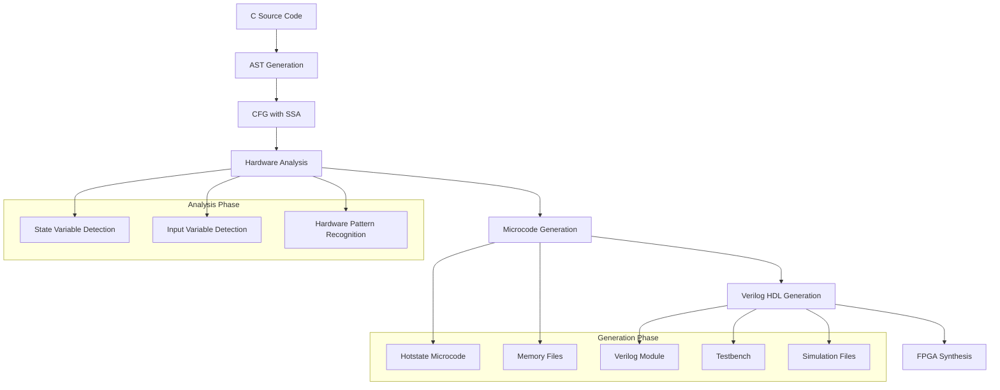

# Hardware Synthesis Documentation

## Overview

The c_parser now supports complete hardware synthesis, converting C programs into FPGA-ready microcode and Verilog HDL. This enables direct translation from high-level C code to synthesizable hardware implementations.

## Hardware Synthesis Pipeline



## Command Line Interface

### Basic Usage

```bash
# Analyze hardware constructs
./c_parser --hardware program.c

# Generate microcode only
./c_parser --microcode program.c

# Generate Verilog module only
./c_parser --verilog program.c

# Generate testbench only
./c_parser --testbench program.c

# Generate complete HDL package
./c_parser --all-hdl program.c
```

### Combined Options

```bash
# Analysis + microcode + HDL
./c_parser --hardware --microcode --all-hdl program.c

# Debug mode with full generation
./c_parser --debug --all-hdl program.c
```

## Hardware Variable Patterns

### State Variables (Outputs)

State variables represent hardware outputs (LEDs, control signals, etc.):

```c
// Pattern: bool VARIABLE = INITIAL_VALUE;
bool LED0 = 0;  // → state0, initially off
bool LED1 = 0;  // → state1, initially off
bool LED2 = 1;  // → state2, initially on

// Naming convention: LED followed by number
bool LED3 = 0;  // → state3
```

**Detection Rules:**
- Must be `bool` type
- Must have initialization (`= 0` or `= 1`)
- Must follow LED naming pattern (`LED` + digit)
- Automatically assigned sequential state numbers

### Input Variables (Inputs)

Input variables represent hardware inputs (buttons, sensors, etc.):

```c
// Pattern: bool VARIABLE;  (no initialization)
bool a0, a1, a2;  // → input0, input1, input2

// Individual declarations also work
bool button;      // → input0
bool sensor;      // → input1
```

**Detection Rules:**
- Must be `bool` type
- Must NOT have initialization
- Automatically assigned sequential input numbers
- Any valid C identifier name accepted

## Hardware Logic Patterns

### Simple State Assignment

```c
if (a0) {
    LED0 = 1;  // Set LED0 when input a0 is high
}
```

### Conditional Logic

```c
if (a0 && a1) {
    LED0 = 1;
    LED1 = 0;
} else {
    LED0 = 0;
    LED1 = 1;
}
```

### Multiple Conditions

```c
if (a0) {
    LED0 = 1;
}

if (a1) {
    LED1 = 1;
}

if (!a2) {
    LED2 = 0;
}
```

## Generated Output Files

### Microcode Files

#### `program_smdata.mem`
Contains the microcode instructions in hotstate format:
```
021100
022200
024400
020000
...
```

#### `program_vardata.mem`
Contains variable mapping information:
```
00
01
02
```

### Verilog HDL Files

#### `program_template.v`
Main synthesizable Verilog module:
```verilog
module program(
    input a0,
    input a1,
    input a2,
    input clk,
    input hlt,
    input rst,
    input interrupt,
    input [3:0] interrupt_address,
    output LED0,
    output LED1,
    output LED2,
    output [3:0] debug_adr,
    output ready);

    wire [2:0] states;
    wire [2:0] variables;

    assign LED0 = states[0];
    assign LED1 = states[1];
    assign LED2 = states[2];

    assign variables = { a2, a1, a0 };

    hotstate #(
        .NUM_STATES (3),
        .NUM_VARS (3),
        // ... parameters
        .MCFILENAME ("program_smdata.mem"),
        .VARFILENAME ("program_vardata.mem")
    ) hotstate_inst (
        .clk(clk),
        .rst(rst),
        // ... connections
    );

endmodule
```

#### `program_tb.v`
Verilog testbench for simulation:
```verilog
`timescale 1ns/1ns

module program_tb;
    reg rst, hlt, clk;
    reg a0, a1, a2;
    wire LED0, LED1, LED2;
    wire ready;

    // Instantiate module under test
    program uut (
        .a0(a0), .a1(a1), .a2(a2),
        .clk(clk), .hlt(hlt), .rst(rst),
        .LED0(LED0), .LED1(LED1), .LED2(LED2),
        .ready(ready)
    );

    // Clock generation
    always #5 clk = ~clk;

    // Test stimulus
    initial begin
        `include "user.v"
    end

endmodule
```

#### `user.v`
User-editable stimulus file:
```verilog
// User-defined test stimulus
clk = 0;
rst = 1;
hlt = 0;
a0 = 0; a1 = 0; a2 = 0;

#10 rst = 0;  // Release reset

// Test pattern 1: Set a0 = 1
#10 a0 = 1;
#20;

// Test pattern 2: Set a1 = 1
#10 a1 = 1;
#20;

#100 $finish;
```

#### `Makefile.sim`
Simulation makefile:
```makefile
MODULE = program
SIMULATOR = iverilog
VIEWER = gtkwave

sim: $(MODULE)_tb.v $(MODULE)_template.v user.v
	$(SIMULATOR) -o $(MODULE)_sim $(MODULE)_tb.v
	vvp $(MODULE)_sim

wave: sim
	$(VIEWER) $(MODULE).vcd

clean:
	rm -f $(MODULE)_sim $(MODULE).vcd

.PHONY: sim wave clean
```

## Simulation and Testing

### Running Simulation

```bash
# Generate HDL files
./c_parser --all-hdl program.c

# Run simulation
make -f Makefile.sim sim

# View waveforms
make -f Makefile.sim wave
```

### Customizing Test Patterns

Edit `user.v` to create custom test sequences:

```verilog
// Initialize
clk = 0; rst = 1; hlt = 0;
a0 = 0; a1 = 0; a2 = 0;

#10 rst = 0;

// Test sequence 1: Button press simulation
#10 a0 = 1;  // Press button a0
#20 a0 = 0;  // Release button a0
#10;

// Test sequence 2: Multiple inputs
#10 a0 = 1; a1 = 1;
#20 a0 = 0; a1 = 0;
#10;

// Test sequence 3: Sensor simulation
#10 a2 = 1;  // Sensor active
#50 a2 = 0;  // Sensor inactive
#10;

#100 $finish;
```

## Hotstate Compatibility

### Microcode Format

The generated microcode is fully compatible with the hotstate IP core:

```
Address | State | Mask | Jump | VarSel | Flags | Description
--------|-------|------|------|--------|-------|------------
0       | 1     | 1    | 0    | 0      | 02    | LED0 = 1
1       | 2     | 2    | 0    | 0      | 02    | LED1 = 1
2       | 0     | 0    | 4    | 0      | 08    | Branch on a0
...
```

### Parameter Calculation

Hardware parameters are automatically calculated:

- **NUM_STATES**: Number of state variables (LEDs)
- **NUM_VARS**: Number of input variables
- **NUM_WORDS**: Number of microcode instructions
- **NUM_ADR_BITS**: Address width (ceil(log2(NUM_WORDS)))
- **NUM_VARSEL_BITS**: Variable selection width

## Advanced Features

### Hardware Analysis Output

```bash
$ ./c_parser --hardware program.c

=== Hardware Analysis Results ===
Analysis successful: Yes

State Variables (Outputs):
  LED0 -> state0 (initial: 0)
  LED1 -> state1 (initial: 0)
  LED2 -> state2 (initial: 1)

Input Variables:
  a0 -> input0
  a1 -> input1
  a2 -> input2
```

### Microcode Analysis Output

```bash
$ ./c_parser --microcode program.c

=== Microcode Analysis ===
Function: main
Total instructions: 21
State assignments: 5
Branch instructions: 2
Jump instructions: 5
Basic blocks: 6

Hardware Resources:
State variables: 3
Input variables: 3

Validation: PASSED
```

## Limitations and Constraints

### Current Limitations

1. **Local Variables Only**: Global variables not yet supported
2. **Simple Expressions**: Complex boolean expressions may need decomposition
3. **No Arithmetic**: Only boolean logic supported
4. **Sequential Logic**: No support for clocked sequential circuits beyond state machines

### Hardware Constraints

1. **State Limit**: Maximum 16 state variables (4-bit state field)
2. **Input Limit**: Maximum 16 input variables (4-bit variable selection)
3. **Instruction Limit**: Maximum 16 microcode instructions (4-bit address)
4. **Boolean Only**: All variables must be boolean type

## Troubleshooting

### Common Issues

**No hardware variables detected:**
- Ensure variables are `bool` type
- Check initialization patterns (states need init, inputs don't)
- Verify naming conventions for state variables

**Microcode validation failed:**
- Check for address bounds errors
- Verify variable references are valid
- Ensure all jump targets exist

**Verilog compilation errors:**
- Check port name conflicts
- Verify parameter ranges
- Ensure memory files exist

### Debug Mode

Use `--debug` flag for detailed analysis:

```bash
./c_parser --debug --all-hdl program.c
```

This provides verbose output showing:
- AST construction details
- CFG building process
- Hardware variable detection
- Microcode generation steps
- Verilog parameter calculation

## Integration with FPGA Tools

### Synthesis Flow

1. **Generate HDL**: `./c_parser --all-hdl program.c`
2. **Simulate**: `make -f Makefile.sim sim`
3. **Synthesize**: Use Vivado, Quartus, or other FPGA tools
4. **Program FPGA**: Load bitstream to target device

### Tool Compatibility

- **Xilinx Vivado**: Supports generated Verilog and memory files
- **Intel Quartus**: Compatible with Verilog output
- **Open Source**: Works with Yosys, nextpnr, and other open tools
- **Simulation**: Compatible with ModelSim, Icarus Verilog, Verilator

## Examples

See `test/test_hardware_local.c` for a complete working example demonstrating all hardware synthesis features.